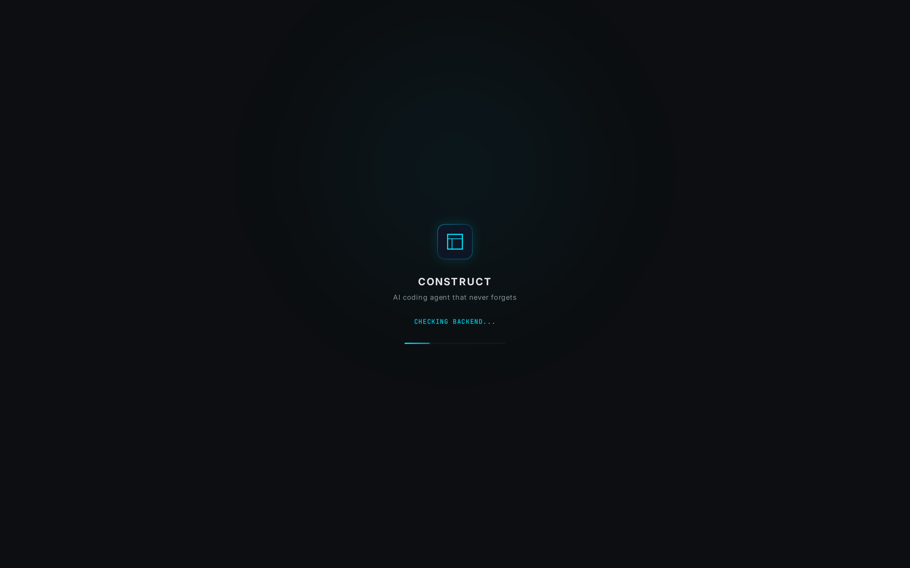
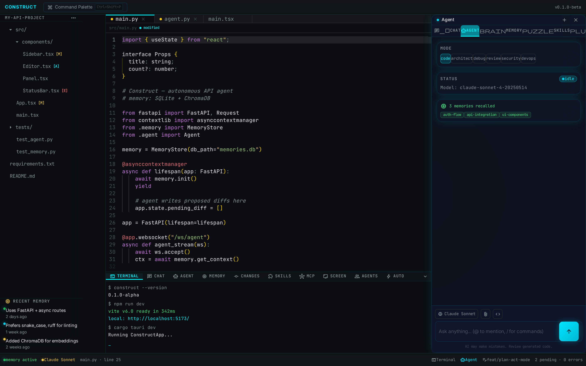
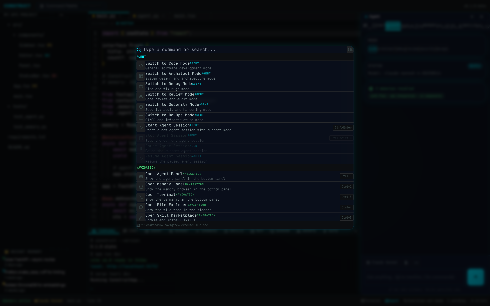

# Construct IDE

## The AI Coding Agent That Never Forgets — Now Inside a Real IDE

© 2026 Construct AI. All Rights Reserved.

[Website](https://construct.ai) • [Docs](https://docs.construct.ai) • [Support](https://support.construct.ai)

---

Construct IDE is a fork of Microsoft VS Code with a built-in AI coding agent powered by a persistent memory system and multi-provider LLM integration. Unlike Cursor or other AI editors that rely on cloud APIs, Construct runs a 100% local Python backend — your code never leaves your machine.

## What You Get

| Feature | Construct IDE |
|---------|--------------|
| Real Terminal | node-pty + xterm.js (not fake) |
| Real LSP | Full IntelliSense for 50+ languages |
| Real Debugger | Breakpoints, variables, call stack |
| Real Git UI | Blame, diff, merge, branch switching |
| 50,000+ Extensions | Full VS Code marketplace compatibility |
| AI Agent | ReAct loop with persistent memory |
| Local-First | Zero data leaves your machine |
| Shadow Filesystem | Review agent changes before applying |

## Screenshots

| Splash Screen | Full IDE View | Agent Panel |
|:---:|:---:|:---:|
|  |  |  |

## Project Structure

```
construct-ai-agent/
├── .github/
│   └── workflows/
│       ├── build-tauri.yml          ← Legacy CI (Tauri)
│       └── build-vscode.yml         ← VS Code fork CI
├── agent-backend/                   ← ⭐ SHARED: Python FastAPI
│   ├── app.py                       ← 89 routes
│   ├── core/
│   │   ├── executor.py              ← ReAct loop
│   │   ├── llm_service.py           ← 10+ providers
│   │   ├── memory.py                ← SQLite + ChromaDB
│   │   ├── safety_monitor.py        ← 41 safety patterns
│   │   ├── telemetry.py             ← Execution traces
│   │   ├── code_graph.py            ← AST + dependency graph
│   │   ├── shadow_fs.py             ← Virtual staging
│   │   ├── lsp_manager.py           ← Language servers
│   │   └── completions.py           ← Inline completions
│   ├── tools/                       ← 39 tools
│   ├── agents/                      ← Multi-agent orchestrator
│   ├── mcp/                         ← MCP client
│   └── requirements.txt
├── src/                             ← LEGACY: Tauri v2 (preserved)
├── vscode-fork/                     ← 🆕 PRIMARY: VS Code fork
│   ├── src/vs/                      ← VS Code core
│   ├── extensions/
│   │   ├── theme-construct/         ← Construct Dark theme
│   │   └── construct-agent/         ← AI agent extension
│   │       ├── src/
│   │       │   ├── extension.ts     ← Entry point
│   │       │   ├── panels/AgentPanel.ts
│   │       │   ├── inline/InlineChatProvider.ts
│   │       │   ├── statusbar/StatusBarContribution.ts
│   │       │   ├── commands/AgentCommands.ts
│   │       │   └── api/ConstructAPI.ts
│   │       └── media/
│   ├── resources/agent-backend/     ← Bundled Python executable
│   ├── product.json                 ← "Construct IDE" branding
│   └── package.json
├── shared-types/                    ← TypeScript API contracts
│   └── api.ts
├── scripts/
│   ├── sync-vscode.sh              ← Sync upstream VS Code
│   └── bundle-backend.sh           ← Build Python executable
├── docs/
│   └── architecture.md
└── README.md
```

## Quick Start

### Prerequisites

- [Node.js](https://nodejs.org/) v20+
- [Python 3.10+](https://python.org/)
- [Yarn](https://yarnpkg.com/) v1.22+

### Development

```bash
# Terminal 1: Start the Python backend
cd agent-backend
python -m venv .venv
source .venv/bin/activate  # Windows: .venv\Scripts\activate
pip install -r requirements.txt
python -m uvicorn app:app --reload --port 8000

# Terminal 2: Start VS Code in dev mode
cd vscode-fork
yarn install
yarn watch
```

### Building

```bash
# Build Python backend as standalone executable
./scripts/bundle-backend.sh

# Build VS Code for your platform
cd vscode-fork
yarn install
yarn compile
# Then platform-specific:
yarn gulp vscode-linux-x64          # Linux
yarn gulp vscode-darwin-arm64       # macOS
yarn gulp vscode-win32-x64          # Windows
```

### Legacy Tauri Frontend

The original Tauri v2 frontend is preserved in `src/` and still works:

```bash
npm install
cd agent-backend && python -m uvicorn app:app --port 8000 &
npm run tauri:dev
```

## Agent System

### LLM Providers

| Provider | Models | Use Case |
|----------|--------|----------|
| OpenAI | GPT-4o | Complex reasoning |
| Anthropic | Claude Sonnet | Code generation |
| Google | Gemini 1.5 Pro | Long context |
| Ollama | qwen2.5-coder:14b | Local, fast, private |

### Tool System (39 Tools)

**File:** read_file, write_file, list_directory, search_files
**Shell:** execute_command, run_test, install_dependency
**Git:** git_status, git_diff, git_commit, git_branch, git_log, git_checkout
**Code:** parse_ast, find_references, refactor_rename, extract_function
**Document:** convert_document, batch_convert_documents, extract_document_structure
**Binary:** analyze_binary, decompile_function, find_vulnerabilities, compare_binaries
**Browser:** browser_navigate, browser_screenshot, browser_extract_text, browser_click
**Code Search:** code_search, code_find_definition, code_find_usages, code_file_structure
**Database:** db_connect_sqlite, db_connect_postgres, db_connect_mysql, db_query, db_list_tables, db_get_schema, db_disconnect

### Execution Loop

```
observe() → plan() → act() → verify()
   ↑___________________________|
```

## Key Bindings

| Shortcut | Action |
|----------|--------|
| `Cmd+Shift+L` / `Ctrl+Shift+L` | Inline chat at cursor |
| `Cmd+Shift+O` / `Ctrl+Shift+O` | New agent chat |
| `Cmd+Shift+P` / `Ctrl+Shift+P` | Command palette (includes Construct commands) |

## Configuration

Copy `.env.example` to `.env` and configure:

```bash
cp .env.example .env
```

VS Code settings (`construct.*`):
- `construct.backendUrl` — Backend URL (default: `http://127.0.0.1:8000`)
- `construct.autoStartBackend` — Auto-start Python process (default: `true`)
- `construct.enableInlineCompletions` — Ghost text suggestions (default: `false`, experimental)

Environment variables:
- `OPENAI_API_KEY` / `ANTHROPIC_API_KEY` / `GOOGLE_API_KEY` — LLM provider keys
- `OLLAMA_HOST` / `OLLAMA_MODEL` — Local LLM configuration
- `DB_PATH` — SQLite database location
- `CHROMA_PATH` — ChromaDB storage directory
- `REQUIRE_APPROVAL` — Safety level for destructive operations

## Upstream Sync

To pull the latest VS Code changes:

```bash
./scripts/sync-vscode.sh           # Normal sync
./scripts/sync-vscode.sh --dry-run # Preview changes
```

## Architecture

See [docs/architecture.md](docs/architecture.md) for the full architecture document.

## Security

- Backend only listens on localhost (127.0.0.1:8000)
- No cloud API calls unless user explicitly configures an LLM provider
- Shadow filesystem ensures agent changes are reviewable before applying
- Safety monitor validates all agent actions against 41 safety patterns
- No telemetry or data collection by default

## License

© 2026 Construct AI. All Rights Reserved.

This software is proprietary and confidential. Unauthorized copying, distribution, or use is strictly prohibited.

See `LICENSE` for the full software license agreement.
See `THIRD_PARTY_LICENSES.md` for open-source component attribution.
See `LEGAL.md` for AI-assisted development disclosure.
